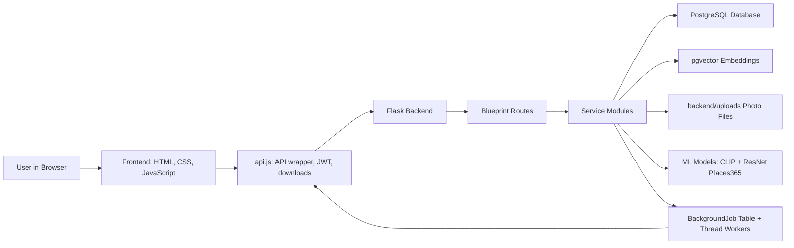
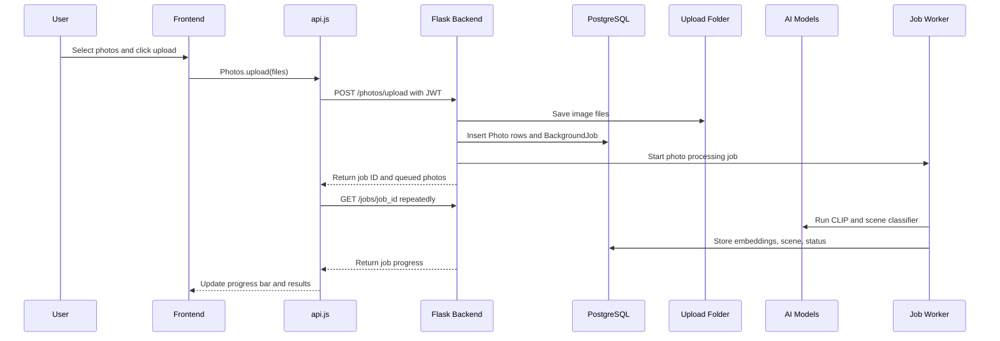
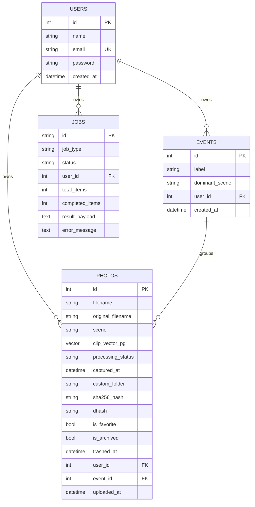
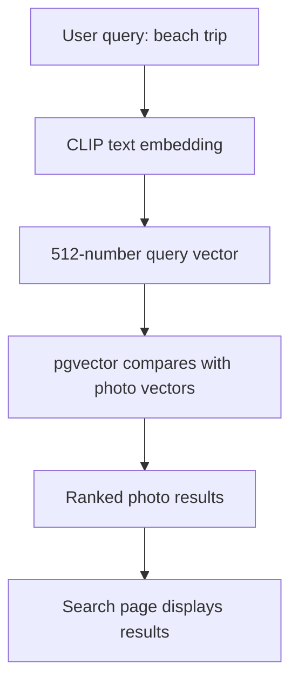

# MemoryLens Beginner Project Guide

This guide explains MemoryLens as if you are seeing the project for the first time. It is written for project reviews, viva, presentations, and interviews.

Use it in three ways:

1. Read Sections 1 to 4 to understand the project story.
2. Read Sections 5 to 12 to understand architecture, code, database, APIs, and AI.
3. Read Sections 13 to 16 before review for speaking points and viva answers.

---

## 1. Project In Simple Words

### What MemoryLens Does

MemoryLens is an AI-powered photo organizer.

It allows a user to:

- Create an account and log in.
- Upload photos.
- Let AI classify each photo by scene, such as Beach, Office, Kitchen, Campus, or Temple.
- Search photos using natural language, such as "beach trip", "classroom", or "food photos".
- Organize photos into event albums.
- Browse photos by timeline: year, month, and day.
- Detect exact and similar duplicate photos.
- Mark favorites, trash photos, restore photos, rename photos, and create custom folders.
- Share photos or albums through expiring share links.
- Export photos or albums as ZIP files.
- Check database, model, vector search, and backup readiness from an admin health page.

Beginner analogy:

Think of MemoryLens like Google Photos, but as your own project. A normal gallery only stores images. MemoryLens understands something about each photo, stores that understanding, and helps the user find and manage photos intelligently.

### Problem It Solves

People usually have many photos on phones and laptops. After some time, it becomes hard to find a specific photo manually.

Common problems are:

- Photos are not sorted.
- File names are not meaningful.
- Searching by file name does not work.
- Similar duplicate photos take space.
- Event-based albums take time to create manually.
- Users forget when a photo was captured.

MemoryLens solves this by using AI and structured storage.

It converts a normal photo library into a smart photo library.

### Why It Is Useful

It is useful because it reduces manual work. Instead of making the user create every folder and album manually, the system automatically extracts useful information.

For example:

- If a user uploads 100 mixed photos, MemoryLens can identify scenes.
- If the user searches "airport", photos from airports can appear even if the file name is `IMG_001.jpg`.
- If two copies of the same photo exist, MemoryLens can detect them.
- If photos belong to similar life categories, MemoryLens can group them into albums.

### Real-World Use Cases

- A student organizes campus, lab, classroom, and event photos.
- A family organizes travel, food, home, and celebration photos.
- A photographer quickly searches through large photo collections.
- A college project team stores project documentation images.
- A user finds duplicates and cleans up storage.
- A reviewer sees a realistic full-stack AI application with auth, database, background processing, and search.

### Main Features

| Feature | What It Means |
|---|---|
| Authentication | Users can register, log in, and access only their own photos. |
| Upload | Users can upload multiple images. |
| Scene Classification | AI predicts the scene of each photo. |
| Semantic Search | User searches by meaning, not only exact text. |
| Event Albums | Photos can be organized into albums. |
| Timeline | Photos are grouped by year, month, and day. |
| Folders | Users can keep AI folders or create custom folders. |
| Duplicate Detection | Exact and similar photo copies can be found. |
| Favorites, Archive, Trash | Gallery management actions. |
| Share Links | Photos and albums can be shared using expiring links. |
| Export | Photos and albums can be downloaded as ZIP files. |
| Admin Health | Shows database, pgvector, models, and backup status. |
| Backup | Creates PostgreSQL dump and uploads archive. |

### Complete Workflow From Start To End

1. User opens MemoryLens.
2. User registers or logs in.
3. Frontend stores authentication tokens.
4. User uploads photos.
5. Backend saves image files in `backend/uploads`.
6. Backend creates photo records in PostgreSQL.
7. Backend creates a background job.
8. AI processing starts in the background.
9. For each photo:
   - EXIF capture time is read.
   - CLIP image embedding is generated.
   - ResNet Places365 scene classifier predicts scene.
   - Duplicate signatures are computed.
   - Photo is marked ready.
10. Frontend polls job progress.
11. Gallery shows processed photos.
12. User can search, organize events, browse timeline, clean duplicates, share, export, or backup.

Review speaking point:

"MemoryLens is a full-stack AI photo organizer. It combines user authentication, file upload, PostgreSQL metadata storage, pgvector-based semantic search, scene classification using Places365, CLIP embeddings, background processing, duplicate detection, event albums, timeline browsing, and sharing/export features."

---

## 2. Architecture Overview

### Simple Architecture Diagram



### Layer-By-Layer Explanation

MemoryLens has these main layers:

1. Frontend layer
2. API communication layer
3. Backend route layer
4. Service/business logic layer
5. Database layer
6. File storage layer
7. AI/ML layer
8. Background job layer
9. Admin/backup layer

### 2.1 Frontend Layer

Location:

- `frontend/index.html`
- `frontend/pages/*.html`
- `frontend/js/*.js`
- `frontend/css/main.css`

This is what the user sees.

It is built using plain HTML, CSS, and JavaScript. There is no React, Angular, or Vue in the current project. Each page is a normal static HTML page, and each page has its own JavaScript file.

Important frontend pages:

| Page | Purpose |
|---|---|
| `index.html` | Login and register page. |
| `pages/upload.html` | Upload photos using drag and drop or file picker. |
| `pages/gallery.html` | Main photo library. |
| `pages/search.html` | Natural-language search. |
| `pages/events.html` | Event album management. |
| `pages/timeline.html` | Year/month/day photo browsing. |
| `pages/duplicates.html` | Duplicate photo cleanup. |
| `pages/share.html` | Public share viewer. |
| `pages/admin-health.html` | Health and backup dashboard. |

Beginner analogy:

The frontend is like a restaurant dining area. The user sits there, clicks buttons, chooses files, and sees results. It does not directly cook the food. It sends requests to the backend kitchen.

### 2.2 API Communication Layer

Location:

- `frontend/js/api.js`

This file is very important. It is the common bridge between frontend pages and Flask backend.

It handles:

- API base URL.
- Access token and refresh token storage.
- Adding `Authorization: Bearer <token>` headers.
- Refreshing JWT access tokens when they are expiring.
- Fetching JSON.
- Uploading files.
- Polling jobs.
- Loading protected photo images.
- Downloading ZIP exports.
- Building share viewer URLs.

Review speaking point:

"The frontend does not directly repeat API logic on every page. A shared `api.js` file centralizes token handling, API calls, downloads, image loading, and job polling."

### 2.3 Backend Route Layer

Location:

- `backend/routes/`

The backend is built with Flask. Routes are grouped using Flask Blueprints.

Blueprint analogy:

A blueprint is like a department in an office. Instead of putting all code in one huge file, each department handles one feature area.

Blueprints in this project:

| Blueprint | URL Prefix | Responsibility |
|---|---|---|
| `auth_bp` | `/auth` | Register, login, refresh token. |
| `photo_bp` | `/photos` | Upload, gallery, file delivery, bulk actions. |
| `search_bp` | `/search` | Natural-language search. |
| `event_bp` | `/events` | Event album organization and management. |
| `timeline_bp` | `/timeline` | Date-based browsing. |
| `duplicates_bp` | `/duplicates` | Exact and similar duplicate detection. |
| `folder_bp` | `/folders` | Folder rename, merge, move, delete. |
| `job_bp` | `/jobs` | Job progress polling. |
| `share_bp` | `/share` | Public share links. |
| `admin_bp` | `/admin` | Health check and backup. |

### 2.4 Service Layer

Location:

- `backend/background_tasks.py`
- `backend/ml_services.py`
- `backend/vector_search.py`
- `backend/duplicate_detection.py`
- `backend/event_album_service.py`
- `backend/photo_metadata.py`
- `backend/share_utils.py`
- `backend/photo_collections.py`
- `backend/security.py`
- `backend/time_utils.py`

The service layer contains reusable logic.

Examples:

- `background_tasks.py` processes uploaded photos and organizes events.
- `vector_search.py` performs pgvector similarity search.
- `duplicate_detection.py` computes SHA-256 and dHash.
- `photo_metadata.py` reads EXIF capture time.
- `share_utils.py` creates signed share tokens and ZIP downloads.
- `event_album_service.py` updates album metadata.

Beginner analogy:

Routes are reception counters. Service modules are the specialists behind the counter who actually do the work.

### 2.5 Database Layer

Location:

- `backend/models/`
- `backend/migrations/`

Database:

- PostgreSQL
- pgvector extension for vector search
- SQLAlchemy ORM for Python database access
- Flask-Migrate/Alembic for migrations

Tables:

- `users`
- `photos`
- `events`
- `jobs`

### 2.6 File Storage Layer

Location:

- `backend/uploads`

The database does not store the full image bytes. It stores file names and metadata. The real image files are saved on disk.

This is common because:

- Image files can be large.
- Databases are better for structured metadata.
- File systems are better for storing raw media files locally.

Example:

Database row:

- `filename = abcd1234.jpg`
- `scene = Beach`
- `user_id = 5`

Actual file:

- `backend/uploads/abcd1234.jpg`

### 2.7 AI/ML Layer

Location:

- `ml/scene_classifier.py`
- `ml/clip_search.py`
- `ml/event_organizer.py`
- `ml/resnet18_places365.pth.tar`
- `ml/categories_places365.txt`

Models:

- ResNet-18 trained for Places365 scene classification.
- CLIP ViT-B/32 for image and text embeddings.

AI jobs:

- Classify scene.
- Generate image embeddings.
- Generate text embeddings during search.
- Support event grouping and semantic search.

### 2.8 Background Job Layer

Location:

- `backend/background_tasks.py`
- `backend/models/job.py`
- `backend/routes/job_routes.py`

Long-running tasks are tracked as jobs.

Why jobs are needed:

AI processing can take time. If the backend tried to finish everything before replying, the browser would wait too long. Instead:

1. Backend accepts upload.
2. Backend creates a `BackgroundJob`.
3. Backend immediately returns job ID.
4. Worker thread processes photos.
5. Frontend polls `/jobs/<job_id>`.
6. UI updates progress.

### 2.9 Admin And Backup Layer

Location:

- `backend/routes/admin_routes.py`
- `backend/backup_cli.py`
- `backend/scripts/backup_postgres.py`

The admin health page checks:

- Database connection.
- Number of users/photos/events/jobs.
- pgvector readiness.
- Scene classifier readiness.
- CLIP readiness.
- Event grouping assets.
- Backup availability.

Backup creates:

- PostgreSQL dump.
- Upload files ZIP.
- Manifest JSON.

---

## 3. Data Flow Through The System

### Main Data Flow Diagram



### What Happens When A User Performs An Action

Every user action follows this general lifecycle:

1. User clicks something in the browser.
2. Page JavaScript handles the click.
3. Page script calls a function from `api.js`.
4. `api.js` adds JWT token if needed.
5. Flask receives request.
6. Flask route validates input and user identity.
7. Backend reads or writes PostgreSQL.
8. Backend may read or write image files.
9. Backend may call AI model helpers.
10. Backend returns JSON or a file response.
11. Frontend updates the page.

Beginner analogy:

This is like ordering food online. You click an item, the app sends an order, the restaurant prepares it, and the app shows status until the food arrives.

---

## 4. Complete Project Structure

### Top-Level Files

| File/Folder | Purpose |
|---|---|
| `.env.example` | Example environment settings. |
| `.gitignore` | Keeps generated files, caches, uploads, backups, and secrets out of Git. |
| `docker-compose.yml` | Starts PostgreSQL with pgvector. |
| `README.md` | Setup and API overview. |
| `backend/` | Flask API, models, routes, services, tests, migrations. |
| `frontend/` | Static HTML/CSS/JS client. |
| `ml/` | ML model code and assets. |
| `docs/` | Project reports, architecture diagrams, notes, and this guide. |

### Backend Folder

| File/Folder | Purpose |
|---|---|
| `backend/app.py` | Creates Flask app, registers extensions and routes. |
| `backend/config/settings.py` | Loads environment variables and app config. |
| `backend/extensions.py` | Defines JWT, limiter, and migration extensions. |
| `backend/models/` | SQLAlchemy database models. |
| `backend/routes/` | API endpoints grouped by feature. |
| `backend/background_tasks.py` | Background photo processing and event organization. |
| `backend/ml_services.py` | Lazy loading access to ML functions. |
| `backend/vector_search.py` | pgvector search logic. |
| `backend/duplicate_detection.py` | SHA-256 and dHash duplicate logic. |
| `backend/photo_metadata.py` | EXIF capture-time extraction. |
| `backend/share_utils.py` | Share tokens and ZIP export helpers. |
| `backend/photo_collections.py` | Active, favorites, archived, trash filters. |
| `backend/security.py` | Email and password validation. |
| `backend/error_handlers.py` | JSON error responses. |
| `backend/migrations/` | Database migration history. |
| `backend/tests/` | Automated backend tests. |

### Frontend Folder

| File/Folder | Purpose |
|---|---|
| `frontend/index.html` | Login/register screen. |
| `frontend/css/main.css` | Shared styling. |
| `frontend/js/api.js` | Shared API layer. |
| `frontend/js/auth.js` | Login/register logic. |
| `frontend/js/upload.js` | Upload and job polling UI. |
| `frontend/js/gallery.js` | Main gallery, folders, bulk actions. |
| `frontend/js/search.js` | Search page logic. |
| `frontend/js/events.js` | Event album UI logic. |
| `frontend/js/timeline.js` | Timeline grouping UI. |
| `frontend/js/duplicates.js` | Duplicate cleanup UI. |
| `frontend/js/share.js` | Public share viewer. |
| `frontend/js/admin_health.js` | Health dashboard and backup action. |

### ML Folder

| File | Purpose |
|---|---|
| `ml/scene_classifier.py` | Loads ResNet-18 Places365 and predicts scene labels. |
| `ml/clip_search.py` | Loads CLIP and generates image/text embeddings. |
| `ml/event_organizer.py` | Maps scenes to event categories and contains clustering helpers. |
| `ml/categories_places365.txt` | Labels for Places365 scenes. |
| `ml/resnet18_places365.pth.tar` | ResNet-18 Places365 model weights. |

---

## 5. Important Backend Files And Functions

### `backend/app.py`

Main function:

- `create_app(test_config=None)`

What it does:

1. Creates Flask app.
2. Loads `Config`.
3. Requires PostgreSQL database URL.
4. Creates instance and upload folders.
5. Configures logging.
6. Enables CORS for allowed frontend origins.
7. Initializes JWT, rate limiter, SQLAlchemy, and migrations.
8. Checks pgvector readiness.
9. Registers JSON error handlers.
10. Registers all route blueprints.
11. Registers CLI commands for backups and vector maintenance.

Review speaking point:

"The Flask app uses an app factory pattern. `create_app()` prepares configuration, extensions, logging, database access, CORS, error handling, and then registers feature-specific blueprints."

### `backend/config/settings.py`

Purpose:

Loads environment variables from `.env` files and turns them into Flask config values.

Important config values:

- `SECRET_KEY`
- `JWT_SECRET_KEY`
- `DATABASE_URL`
- `UPLOAD_FOLDER`
- `ML_FOLDER`
- `VECTOR_BACKEND`
- `CLIP_VECTOR_DIM`
- `FRONTEND_ORIGINS`
- `JWT_ACCESS_MINUTES`
- `JWT_REFRESH_DAYS`
- `AUTH_RATE_LIMIT`
- `TASKS_EAGER`

Beginner explanation:

Configuration means settings that can change between machines, such as database URL, secret keys, and upload folder path. We keep them outside code so the same code can run in development, demo, or deployment.

### `backend/extensions.py`

Purpose:

Creates extension objects once:

- `jwt = JWTManager()`
- `migrate = Migrate()`
- `limiter = Limiter(...)`

These are later initialized inside `create_app()`.

### `backend/models/user.py`

Model:

- `User`

Fields:

- `id`: Unique user ID.
- `name`: User full name.
- `email`: Login email, unique.
- `password`: Hashed password.
- `created_at`: Account creation time.

Relationship:

- One user has many photos.
- One user has many jobs.

Important method:

- `to_dict()` returns safe public user details without password.

### `backend/models/photo.py`

Model:

- `Photo`

This is the most important table in the project.

Important fields:

| Field | Meaning |
|---|---|
| `id` | Unique photo ID. |
| `filename` | Stored file name in upload folder. |
| `original_filename` | User's original file name. |
| `scene` | AI-predicted scene label. |
| `clip_vector_pg` | CLIP embedding stored as pgvector. |
| `clip_model_version` | Version/name of CLIP model used. |
| `scene_model_version` | Version/name of scene classifier used. |
| `processing_status` | `queued`, `in_progress`, `ready`, or `failed`. |
| `processing_error` | Error text if processing failed. |
| `captured_at` | Photo capture time from EXIF metadata. |
| `display_name` | User custom name for photo. |
| `custom_folder` | User-selected folder override. |
| `sha256_hash` | Exact duplicate hash. |
| `dhash` | Similar-image perceptual hash. |
| `is_favorite` | Favorite flag. |
| `is_archived` | Archive flag. |
| `trashed_at` | Trash timestamp. |
| `user_id` | Owner user. |
| `event_id` | Optional album/event ID. |
| `uploaded_at` | Upload time. |

Important methods:

- `filepath(upload_root)`: Returns actual file path.
- `set_clip_embedding(vector)`: Saves vector into pgvector column.
- `get_clip_embedding()`: Reads embedding back as NumPy array.
- `folder_label()`: Uses custom folder if present; otherwise scene label.
- `to_dict()`: Converts photo into JSON-friendly form.

Review speaking point:

"The `photos` table is the central table. It connects file storage, AI metadata, duplicate hashes, user ownership, folder state, event album membership, and search embeddings."

### `backend/models/event.py`

Model:

- `Event`

Fields:

- `id`
- `label`
- `dominant_scene`
- `user_id`
- `created_at`

Relationship:

- One event has many photos.

Important method:

- `to_dict()` returns event information, photo count, and preview photos.

### `backend/models/job.py`

Model:

- `BackgroundJob`

Fields:

- `id`: UUID job ID.
- `job_type`: `photo_processing` or `event_organization`.
- `status`: `queued`, `in_progress`, `completed`, `completed_with_errors`, or `failed`.
- `user_id`: Owner.
- `total_items`: Total work count.
- `completed_items`: Completed count.
- `result_payload`: JSON text result.
- `error_message`: Error if failed.
- `created_at`, `updated_at`

Important method:

- `to_dict()` returns progress percentage and parsed result.

Review speaking point:

"Background jobs make the UI responsive. The backend returns a job ID immediately, and the frontend polls the job endpoint to show progress."

---

## 6. Database Schema

### Database Diagram



### Why PostgreSQL Is Used

PostgreSQL is a powerful relational database.

It is used because:

- It supports reliable structured data storage.
- It supports relationships using foreign keys.
- It works well with SQLAlchemy and migrations.
- It supports pgvector for vector similarity search.
- It is more production-ready than SQLite for this project.

Why not SQLite:

- SQLite is simple, but it is not ideal for pgvector search.
- PostgreSQL handles multi-user and larger applications better.
- README and app startup now require PostgreSQL only.

### What pgvector Does

pgvector is a PostgreSQL extension that stores vectors and searches by similarity.

Beginner analogy:

A vector is like a numerical fingerprint of meaning. For a photo, CLIP creates a list of 512 numbers. Similar images or matching text queries have vectors that point in similar directions.

MemoryLens stores each photo's CLIP vector in:

- `photos.clip_vector_pg`

Search uses:

- PostgreSQL vector distance operator `<=>`

In `vector_search.py`, search calculates:

```sql
1 - (clip_vector_pg <=> query_vector)
```

This produces a similarity score.

---

## 7. API Routes Explained

### Auth Routes

File:

- `backend/routes/auth_routes.py`

Routes:

| Route | Method | Purpose |
|---|---|---|
| `/auth/register` | POST | Create account and return JWTs. |
| `/auth/login` | POST | Verify password and return JWTs. |
| `/auth/refresh` | POST | Use refresh token to create fresh access token. |

Internal logic:

1. Read JSON request body.
2. Validate required fields.
3. Validate email format.
4. Validate password strength during registration.
5. Check duplicate email.
6. Hash password using Werkzeug.
7. Store user in database.
8. Return access token, refresh token, and user details.

### Photo Routes

File:

- `backend/routes/photo_routes.py`

Important routes:

| Route | Method | Purpose |
|---|---|---|
| `/photos/upload` | POST | Upload images and create processing job. |
| `/photos/all` | GET | List user's photos with filters. |
| `/photos/scenes` | GET | Return scene/folder counts. |
| `/photos/bulk` | POST | Favorite, trash, restore, delete, move, folder assignment. |
| `/photos/retry` | POST | Retry failed photo processing. |
| `/photos/export` | POST | Export selected photos as ZIP. |
| `/photos/share` | POST | Create expiring share link. |
| `/photos/<id>/rename` | POST | Rename photo display name. |
| `/photos/<id>/file` | GET | Serve protected photo file. |
| `/photos/<id>` | DELETE | Permanently delete photo. |

### Search Route

File:

- `backend/routes/search_routes.py`

Route:

- `GET /search?q=...`

Internal logic:

1. Check that query is not empty.
2. Convert text query into CLIP text embedding.
3. Use pgvector to compare query embedding with photo embeddings.
4. Add a small scene-name boost if query matches photo scene.
5. Sort by final score.
6. Return top relevant photos.

### Event Routes

File:

- `backend/routes/event_routes.py`

Routes:

| Route | Method | Purpose |
|---|---|---|
| `/events/organize` | POST | Start event organization background job. |
| `/events/all` | GET | List event albums. |
| `/events/<id>/photos` | GET | Get photos inside one event. |
| `/events/<id>` | PATCH | Rename event. |
| `/events/merge` | POST | Merge multiple event albums. |
| `/events/<id>/split` | POST | Split selected photos into new event. |
| `/events/move-photos` | POST | Move photos to another event. |
| `/events/<id>/remove-photos` | POST | Remove photos from an event. |
| `/events/<id>/export` | GET | Export event as ZIP. |
| `/events/<id>/share` | POST | Create event share link. |
| `/events/<id>` | DELETE | Delete event album. |

### Timeline Route

File:

- `backend/routes/timeline_routes.py`

Route:

- `GET /timeline?group=year|month|day`

Internal logic:

1. Get user photos.
2. Choose timestamp: `captured_at` if available, otherwise `uploaded_at`.
3. Group photos into year, month, or day buckets.
4. Return periods with labels, start/end dates, count, and photos.

### Duplicate Routes

File:

- `backend/routes/duplicates_routes.py`

Routes:

| Route | Method | Purpose |
|---|---|---|
| `/duplicates` | GET | Return duplicate groups. |
| `/duplicates/scan` | POST | Recalculate hashes. |
| `/duplicates/trash` | POST | Move selected duplicates to trash. |
| `/duplicates/keep` | POST | Keep one copy and trash others. |

### Folder Routes

File:

- `backend/routes/folder_routes.py`

Routes:

| Route | Method | Purpose |
|---|---|---|
| `/folders/all` | GET | List folders and counts. |
| `/folders/move-photos` | POST | Move photos to custom folder or AI folder. |
| `/folders/rename` | POST | Rename folder. |
| `/folders/merge` | POST | Merge folders. |
| `/folders/delete` | POST | Delete custom folder. |

### Job Route

File:

- `backend/routes/job_routes.py`

Route:

- `GET /jobs/<job_id>`

Purpose:

Returns job progress for the authenticated user.

### Share Routes

File:

- `backend/routes/share_routes.py`

Routes:

- `/share/photos/<token>`
- `/share/photos/<token>/file/<photo_id>`
- `/share/photos/<token>/download`
- `/share/events/<token>`
- `/share/events/<token>/file/<photo_id>`
- `/share/events/<token>/download`

Purpose:

Allows public access to selected photos or albums using a signed expiring token.

### Admin Routes

File:

- `backend/routes/admin_routes.py`

Routes:

- `GET /admin/health`
- `POST /admin/backup`

Purpose:

Health checks and backup creation.

Review note:

Before public deployment, admin backup/health routes should be protected with admin authentication. In the current academic/demo project, they are available as operational checks.

---

## 8. AI And ML Pipeline

### AI Pipeline During Upload

When a photo is uploaded, the active processing flow is in:

- `backend/background_tasks.py`

Function:

- `_process_photo_job(app, job_id, photo_ids)`

For each photo:

1. Read the photo from upload folder.
2. Extract EXIF capture time.
3. Generate CLIP image embedding.
4. Store embedding in PostgreSQL pgvector column.
5. Run scene classifier.
6. Store scene label.
7. Compute SHA-256 and dHash duplicate signatures.
8. Mark photo `ready`.
9. Update job progress.

### Scene Classification

File:

- `ml/scene_classifier.py`

Model:

- ResNet-18 Places365

What it does:

It looks at an image and predicts the scene category. Scene means the type of place or environment shown in the image.

Examples:

- Beach
- Office
- Kitchen
- Classroom
- Airport Terminal
- Park

How it works internally:

1. Load image using Pillow.
2. Convert image to RGB.
3. Resize image to 256 x 256.
4. Center crop to 224 x 224.
5. Convert image to tensor.
6. Normalize pixel values.
7. Pass tensor through ResNet-18.
8. Get output scores for 365 scene categories.
9. Apply softmax to convert scores into probabilities.
10. Choose highest probability label.
11. Clean label formatting and return title case.

Beginner analogy:

Scene classification is like showing a photo to a person and asking, "What kind of place is this?"

### CLIP Embeddings

File:

- `ml/clip_search.py`

Model:

- CLIP ViT-B/32

What CLIP does:

CLIP understands both images and text in the same vector space.

Vector space analogy:

Imagine a map of meaning. Photos and text are placed on the same map. A beach photo and the text "beach trip" will be close to each other on that map.

Image embedding:

- `get_clip_embedding(image_path)`
- Converts image into a 512-dimensional vector.

Text embedding:

- `get_text_embedding(text)`
- Converts user query into a 512-dimensional vector.

Why normalized vectors are used:

The code divides features by their length. This makes comparison more about direction/meaning than raw magnitude.

### Search With CLIP And pgvector

Search path:

1. User types query in search page.
2. `frontend/js/search.js` calls `Search.query(query)`.
3. `api.js` sends `GET /search?q=query`.
4. Backend creates text embedding using CLIP.
5. `vector_search.py` compares query vector to stored photo vectors.
6. PostgreSQL pgvector returns closest photos.
7. `search_routes.py` adds scene boost.
8. Frontend shows ranked results with relevance percentage.

Search flow diagram:



### Duplicate Detection

File:

- `backend/duplicate_detection.py`

Two techniques are used:

1. SHA-256
2. dHash

#### SHA-256

SHA-256 is a cryptographic hash.

It checks exact duplicates.

If two files have the exact same bytes, their SHA-256 hash will be the same.

Analogy:

SHA-256 is like a perfect fingerprint of the file. If even one byte changes, the fingerprint changes.

#### dHash

dHash means difference hash.

It detects visually similar images.

How dHash works in simple words:

1. Convert image to grayscale.
2. Resize it to a small size.
3. Compare neighboring pixels.
4. Store whether left pixel is brighter than right pixel.
5. Convert comparisons into a compact hash.

Two images can have slightly different files but similar dHash values.

Analogy:

dHash is like a rough sketch of the image. It does not capture everything, but it can tell if two images look almost the same.

### Event Organization

Files:

- `backend/background_tasks.py`
- `ml/event_organizer.py`
- `backend/event_album_service.py`

Important clarification:

The project has an advanced `ml/event_organizer.py` module with category mapping, PCA, KMeans, time-gap logic, and CLIP subclustering helpers. In the current active backend flow, `/events/organize` uses scene category mapping from `event_organizer.py` through `_categorize_scene()` and assigns ready, unorganized photos to category albums.

Active event organization flow:

1. User clicks "Organize New Photos".
2. Frontend calls `POST /events/organize`.
3. Backend creates `BackgroundJob`.
4. Worker selects ready photos without an event.
5. For each photo, scene is mapped to a broader category.
6. Example: Beach -> Vacation & Outdoors.
7. Backend creates or reuses matching event album.
8. Photo gets assigned to event.
9. Event metadata is recomputed.
10. Job result returns created/matched album counts.

Event category examples:

- Home -> Home Moments
- Beach, mountain, park -> Vacation & Outdoors
- Classroom, library -> Campus & Learning
- Restaurant, coffee shop -> Food & Dining
- Office, conference room -> Work & Public Life
- Airport, highway, train station -> Travel & Transit

Review speaking point:

"The event module maps detailed scene labels into broader human-friendly album categories. This makes albums more useful than raw scene labels."

---

## 9. Authentication Flow

### What Authentication Means

Authentication means proving who the user is.

In MemoryLens:

- Register creates an account.
- Login verifies email and password.
- JWT tokens prove identity for future requests.

### Register Flow

Route:

- `POST /auth/register`

Steps:

1. User enters name, email, password.
2. Frontend sends JSON to backend.
3. Backend checks all fields exist.
4. Backend validates email.
5. Backend checks password strength:
   - Minimum 8 characters.
   - At least one uppercase letter.
   - At least one lowercase letter.
   - At least one number.
6. Backend checks whether email already exists.
7. Backend hashes password.
8. Backend stores user.
9. Backend returns access token and refresh token.
10. Frontend stores tokens in `localStorage`.
11. User goes to gallery.

### Login Flow

Route:

- `POST /auth/login`

Steps:

1. User enters email and password.
2. Backend finds user by email.
3. Backend compares password with stored hash.
4. If valid, backend returns JWT access and refresh tokens.
5. Frontend stores tokens and user details.
6. User enters authenticated pages.

### JWT Explained

JWT means JSON Web Token.

It is a signed token that contains information such as user ID and expiration time.

Beginner analogy:

A JWT is like an entry pass. After login, the user receives a pass. For every protected request, the user shows the pass to the backend.

### Access Token And Refresh Token

Access token:

- Short-lived.
- Used for normal API requests.

Refresh token:

- Longer-lived.
- Used to get a new access token when the old one is expiring.

In `frontend/js/api.js`:

- `ensureAccessToken()` checks whether access token is expiring.
- `refreshAccessToken()` calls `/auth/refresh`.
- `apiFetch()` retries request after refreshing token if needed.

### Protected Photo Delivery

Photos are not served directly as public static files.

The frontend loads photos through:

- `GET /photos/<id>/file`

This route requires JWT and checks:

1. Photo belongs to current user.
2. File exists.
3. Send file response.

Why this matters:

It prevents one user from directly opening another user's photo if they guess a filename.

---

## 10. Frontend Working In Detail

### `frontend/js/api.js`

This is the most important frontend JavaScript file.

Major responsibilities:

- `API_BASE`: Chooses backend URL.
- `getToken()`: Reads access token.
- `setAuthTokens()`: Saves access and refresh tokens.
- `clearToken()`: Logs user out and redirects.
- `requireAuth()`: Protects pages.
- `apiFetch()`: Sends authenticated API requests.
- `getJsonOrThrow()`: Parses JSON and throws error on failed response.
- `Photos.upload()`: Uploads image files using XMLHttpRequest.
- `Jobs.waitForCompletion()`: Polls job status.
- `getProtectedPhotoUrl()`: Fetches protected image blob and creates object URL.
- `hydrateProtectedImages()`: Loads images into ``.
- API objects: `Auth`, `Photos`, `Folders`, `Jobs`, `Search`, `Timeline`, `Duplicates`, `Events`, `Shared`.

### Login Page

Files:

- `frontend/index.html`
- `frontend/js/auth.js`

Flow:

1. If session exists, redirect to gallery.
2. User switches between login and register tabs.
3. Login calls `Auth.login()`.
4. Register calls `Auth.register()`.
5. On success, tokens and user are stored.
6. Browser moves to `pages/gallery.html`.

### Upload Page

Files:

- `frontend/pages/upload.html`
- `frontend/js/upload.js`

Flow:

1. Page calls `requireAuth()`.
2. User drags or selects image files.
3. JavaScript shows preview cards.
4. User clicks classify/upload.
5. `Photos.upload()` sends `multipart/form-data`.
6. Upload progress bar updates using XHR progress events.
7. Backend returns job ID.
8. `Jobs.waitForCompletion()` polls backend.
9. Results show scene labels or errors.

### Gallery Page

Files:

- `frontend/pages/gallery.html`
- `frontend/js/gallery.js`

Features:

- Displays photo grid.
- Loads active/favorites/trash collections.
- Shows folder filters.
- Shows stats.
- Supports infinite scrolling using `IntersectionObserver`.
- Supports bulk actions.
- Supports rename, favorite, trash, restore, delete, share, download.
- Shows lightbox and details panel.
- Auto-refreshes while photos are processing.

### Search Page

Files:

- `frontend/pages/search.html`
- `frontend/js/search.js`

Flow:

1. User enters search text.
2. JS calls `Search.query(text)`.
3. Backend returns ranked photos.
4. UI displays result grid with relevance score.

### Events Page

Files:

- `frontend/pages/events.html`
- `frontend/js/events.js`

Features:

- Organize new photos into event albums.
- Display event cards with preview images.
- Rename, share, export, delete albums.
- Merge selected albums.
- Open album modal.
- Split selected photos into new album.
- Move photos between albums with selection or drag/drop.

### Timeline Page

Files:

- `frontend/pages/timeline.html`
- `frontend/js/timeline.js`

Features:

- Browse photos by year, month, or day.
- Drill down from year -> month -> day.
- Uses `captured_at` if available.
- Falls back to `uploaded_at`.
- Opens photo lightbox.

### Duplicates Page

Files:

- `frontend/pages/duplicates.html`
- `frontend/js/duplicates.js`

Features:

- Shows exact and similar duplicate groups.
- Shows confidence score.
- Allows user to keep one photo.
- Allows user to trash selected duplicates.
- Supports duplicate scan.

### Share Page

Files:

- `frontend/pages/share.html`
- `frontend/js/share.js`

Flow:

1. Share URL contains `kind` and `token`.
2. Page calls public share API.
3. Backend verifies signed token and expiry.
4. Page displays shared photos.
5. User can download shared ZIP.

### Admin Health Page

Files:

- `frontend/pages/admin-health.html`
- `frontend/js/admin_health.js`

Features:

- Displays backend health status.
- Shows database counts.
- Shows pgvector status.
- Shows model readiness.
- Shows backup readiness.
- Can trigger backup.
- Refreshes periodically.

---

## 11. Request-Response Lifecycle Examples

### A. User Opens The App

1. Browser loads `frontend/index.html`.
2. HTML loads CSS and JavaScript.
3. `auth.js` checks `hasSession()`.
4. If tokens exist, redirect to gallery.
5. Otherwise show sign in/register form.

Speaking point:

"The app starts at the login page. If a session exists in localStorage, the user is taken to the gallery. Otherwise, the user must authenticate."

### B. User Logs In

1. User enters email and password.
2. `handleLogin()` runs in `auth.js`.
3. It calls `Auth.login(email, password)`.
4. `api.js` sends `POST /auth/login`.
5. Flask route reads JSON.
6. Backend finds user by email.
7. Backend checks password hash.
8. Backend creates JWT access and refresh tokens.
9. Backend returns JSON with tokens and user.
10. Frontend stores tokens in `localStorage`.
11. Frontend redirects to gallery.

### C. User Uploads Photos

1. User opens upload page.
2. `requireAuth()` checks session.
3. User selects files.
4. Frontend filters image files.
5. Frontend shows previews using `FileReader`.
6. User clicks upload.
7. `Photos.upload()` builds `FormData`.
8. It sends `POST /photos/upload` with JWT.
9. Backend checks JWT.
10. Backend validates file extensions.
11. Backend saves files to upload folder with UUID names.
12. Backend computes duplicate signatures.
13. Backend creates `Photo` rows with status `queued`.
14. Backend creates a `BackgroundJob` row.
15. Backend commits database changes.
16. Backend submits worker thread.
17. Backend returns HTTP 202 with job ID.
18. Frontend polls `/jobs/<job_id>`.
19. Worker processes AI tasks.
20. Frontend displays results.

### D. Backend Receives Upload Request

Route:

- `upload_photos()` in `photo_routes.py`

Internal steps:

1. `get_jwt_identity()` gets current user ID.
2. `request.files.getlist('files')` reads files.
3. `allowed_file()` checks extension.
4. `secure_filename()` sanitizes original name.
5. UUID file name is created.
6. `file.save(filepath)` stores file.
7. `compute_duplicate_signatures(filepath)` creates hashes.
8. `Photo(...)` row is created.
9. `BackgroundJob(...)` row is created.
10. `db.session.commit()` saves database records.
11. `submit_photo_processing_job(...)` starts background work.

### E. AI Model Processes Data

Function:

- `_process_photo_job()`

For each photo:

1. Load photo record.
2. Extract EXIF date using `extract_photo_metadata()`.
3. Generate CLIP embedding using `get_clip_embedding()`.
4. Store vector using `photo.set_clip_embedding()`.
5. Classify scene using `classify_scene()`.
6. Compute missing duplicate hashes.
7. Save model versions.
8. Set `processing_status = ready`.
9. Update job progress.
10. Commit after each photo.

### F. Search Happens

1. User enters query like "beach sunset".
2. Frontend calls `GET /search?q=beach%20sunset`.
3. Backend converts query into CLIP text embedding.
4. pgvector compares text vector with stored image vectors.
5. Backend gets most similar ready photos.
6. Backend adds scene boost if query overlaps scene label.
7. Backend returns top 20 results.
8. Frontend displays photo cards and relevance bars.

### G. Results Are Displayed

1. Frontend receives JSON array of photo metadata.
2. It creates DOM cards.
3. Images are not loaded by normal file path.
4. Each image has `data-photo-id`.
5. `hydrateProtectedImages()` fetches protected image blobs.
6. Browser displays object URLs.

---

## 12. Technologies Used

### HTML

What it is:

HTML defines the structure of web pages.

Why used:

The frontend is a static app made of pages, forms, buttons, grids, modals, and navigation.

Where used:

- `frontend/index.html`
- `frontend/pages/*.html`

Alternative:

- React JSX, Vue templates, Angular templates.

Why this project uses plain HTML:

It keeps the frontend simple, easy to host, and easy to explain in academic review.

### CSS

What it is:

CSS styles HTML.

Why used:

To create the dark UI theme, cards, buttons, grids, badges, toasts, and responsive layout.

Where used:

- `frontend/css/main.css`
- small inline styles in some HTML files.

### JavaScript

What it is:

JavaScript makes web pages interactive.

Why used:

It handles login, upload, API requests, gallery rendering, search, timeline, duplicate actions, events, sharing, and health checks.

Where used:

- `frontend/js/*.js`

Why plain JavaScript instead of React:

For this project, plain JavaScript is enough and avoids framework complexity. It also makes the request-response flow clearer.

### Fetch API

What it is:

Browser API for HTTP requests.

Where used:

- `apiFetch()`
- `getJsonOrThrow()`
- share and health calls.

Why used:

To call Flask endpoints from the browser.

### XMLHttpRequest

What it is:

Older browser API for HTTP requests.

Where used:

- `Photos.upload()` in `api.js`

Why used:

It provides upload progress events, which are useful for the upload progress bar.

### localStorage

What it is:

Browser storage that persists key-value pairs.

Where used:

- Stores `ml_token`
- Stores `ml_refresh_token`
- Stores `ml_user`

Why used:

To keep the user logged in after page reloads.

Security note:

For production, secure HTTP-only cookies can be safer against XSS. For this academic static frontend, localStorage is simple and easy to demonstrate.

### Flask

What it is:

Python web framework.

Where used:

- `backend/app.py`
- `backend/routes/*.py`

Why used:

It is lightweight and easy to structure with routes and blueprints.

Why selected instead of Django:

Flask gives more control and less built-in complexity. Django is powerful but heavier and includes more default systems than this project needs.

### Flask Blueprints

What they are:

Blueprints group related routes.

Where used:

- `auth_bp`
- `photo_bp`
- `search_bp`
- `event_bp`
- others.

Why used:

To keep route files modular and maintainable.

### Flask-CORS

What it is:

CORS controls which frontend origins can call the backend.

Where used:

- `CORS(app, resources=...)` in `app.py`

Why used:

The frontend may run at `localhost:5500` or `localhost:3000`, while backend runs at `localhost:5000`. Browsers block cross-origin requests unless CORS allows them.

### Flask-JWT-Extended

What it is:

A Flask extension for JWT authentication.

Where used:

- `auth_routes.py`
- `@jwt_required()`
- `get_jwt_identity()`

Why used:

To protect routes and identify the current user.

### Flask-Limiter

What it is:

Rate limiting extension.

Where used:

- Auth routes use `@limiter.limit(...)`.

Why used:

To prevent too many login/register attempts in a short time.

### SQLAlchemy

What it is:

Python ORM for database operations.

ORM explanation:

ORM means Object Relational Mapper. It lets us use Python classes like `User` and `Photo` instead of writing SQL for every operation.

Where used:

- `backend/models/*.py`
- route queries like `Photo.query.filter(...)`

Why used:

It simplifies database access and keeps code readable.

### Flask-Migrate And Alembic

What they are:

Migration tools for database schema changes.

Migration explanation:

A migration is like a version history for database structure.

Where used:

- `backend/migrations/`

Why used:

As the project evolves, tables and columns change. Migrations apply these changes safely.

### PostgreSQL

What it is:

Production-grade relational database.

Where used:

- Stores users, photos, events, jobs, and vector embeddings.

Why used:

It supports strong data relationships and pgvector.

### pgvector

What it is:

PostgreSQL extension for vector storage and similarity search.

Where used:

- `Photo.clip_vector_pg`
- `backend/vector_search.py`

Why used:

To perform semantic search using CLIP embeddings directly inside PostgreSQL.

Alternative:

- FAISS
- Pinecone
- Milvus
- Weaviate

Why pgvector was selected:

It keeps relational data and vector search in one PostgreSQL database, simplifying deployment and backup.

### Docker Compose

What it is:

Tool to run services like PostgreSQL using containers.

Where used:

- `docker-compose.yml`

Why used:

To start PostgreSQL + pgvector easily with one command.

### PyTorch

What it is:

Machine learning library for running neural networks.

Where used:

- `ml/scene_classifier.py`
- `ml/clip_search.py`

Why used:

Both ResNet and CLIP model inference run with PyTorch.

### torchvision

What it is:

PyTorch library for computer vision models and image transforms.

Where used:

- ResNet-18 model creation.
- Image resize, crop, tensor conversion, normalization.

### ResNet-18 Places365

What it is:

A convolutional neural network trained to classify scene categories.

Where used:

- `ml/scene_classifier.py`

Why used:

Places365 is scene-focused. It is better for labels like airport, classroom, kitchen, and beach than a generic object classifier.

### CLIP

What it is:

OpenAI model that connects text and images in the same embedding space.

Where used:

- `ml/clip_search.py`

Why used:

It enables natural-language photo search.

### Pillow

What it is:

Python image processing library.

Where used:

- Opening images.
- Reading EXIF metadata.
- Creating duplicate hashes.
- Preprocessing images for ML.

### NumPy

What it is:

Library for numerical arrays.

Where used:

- Vector conversion and normalization.
- Embedding handling.

### scikit-learn

What it is:

Machine learning utilities library.

Where used:

- `ml/event_organizer.py`
- KMeans, PCA, silhouette score, normalization.

Note:

The current active `/events/organize` flow uses category matching, while `event_organizer.py` contains richer clustering helpers.

### Werkzeug

What it is:

Web utility library used by Flask.

Where used:

- Password hashing/checking.
- Secure filename handling.

### itsdangerous

What it is:

Library for signed tokens.

Where used:

- `backend/share_utils.py`

Why used:

It creates share tokens that cannot be easily tampered with.

---

## 13. Module-Wise Review Notes

### Authentication Module

What to say:

"The authentication module lets users register and log in. Passwords are hashed before storage. The backend returns JWT access and refresh tokens. Protected APIs use `@jwt_required()` so each user can access only their own photos."

Likely questions:

Q: Why hash passwords?

A: We should never store plain passwords. Hashing stores a transformed value, so even if the database is exposed, actual passwords are not directly visible.

Q: Why JWT?

A: JWT is stateless. The backend can verify the token without storing session data for every request.

### Upload And Processing Module

What to say:

"Upload stores files on disk and metadata in PostgreSQL. AI processing is handled in a background job, so the UI does not freeze while CLIP and ResNet process the photos."

Likely questions:

Q: Why background jobs?

A: AI inference can be slow. Jobs allow the API to return quickly and the frontend can poll progress.

Q: Where are photos stored?

A: Actual image files are stored in `backend/uploads`, while metadata and AI results are stored in PostgreSQL.

### Search Module

What to say:

"Search is semantic, not only keyword-based. CLIP converts both photos and text into vectors. pgvector finds photo vectors close to the query vector."

Likely questions:

Q: What is semantic search?

A: It searches by meaning. For example, "beach trip" can find beach images even if the file name does not contain beach.

Q: Why pgvector?

A: It allows vector similarity search inside PostgreSQL, so we do not need a separate vector database.

### Event Module

What to say:

"Event albums group ready photos into broader scene-based categories like Vacation & Outdoors, Campus & Learning, and Food & Dining. Users can also merge, split, rename, move, export, and share albums."

Likely questions:

Q: How are events created?

A: The backend takes ready photos without an event, maps their AI scene labels to broader categories, creates or reuses matching albums, and assigns photos.

### Duplicate Module

What to say:

"Duplicate detection uses SHA-256 for exact copies and dHash for visually similar photos. Exact duplicates have the same file hash. Similar photos have small perceptual hash distance."

Likely questions:

Q: Why use both SHA-256 and dHash?

A: SHA-256 catches exact file copies. dHash can catch near duplicates, such as resized or slightly changed photos.

### Timeline Module

What to say:

"Timeline groups photos by date. It prefers EXIF capture time from the photo file, and falls back to upload time if EXIF is missing."

Likely questions:

Q: Why use EXIF?

A: EXIF gives the actual camera capture time, which is more meaningful than upload time for timeline browsing.

### Sharing And Export Module

What to say:

"Users can share selected photos or albums using signed expiring tokens. Export creates ZIP files with photos and a manifest JSON."

Likely questions:

Q: How do share links stay safe?

A: The token is signed using the secret key and has an expiration time. The backend verifies the token before serving shared content.

### Admin Health Module

What to say:

"The health page is useful for demos and operations. It checks database connection, pgvector readiness, model assets, counts, and backups."

Likely questions:

Q: Why do we need a health page?

A: It helps quickly verify that all important subsystems are ready before a demo or review.

---

## 14. Limitations And Future Improvements

### Current Limitations

1. Background jobs use an in-process thread pool.
2. If the backend process stops, active in-memory jobs may stop.
3. Admin routes should be protected before public deployment.
4. First AI model load may be slow because models load lazily.
5. `memory://` rate limiting is fine locally but not for distributed production.
6. Event organization currently uses category mapping in the active worker path; clustering helpers exist but are not the main active route behavior.
7. Search depends on CLIP quality and available embeddings.
8. Local disk uploads are fine for local/demo use but cloud storage is better for production.

### Future Improvements

| Improvement | Benefit |
|---|---|
| Celery or RQ worker queue | Durable background jobs. |
| Redis for rate limiting/jobs | Production-ready coordination. |
| Cloud object storage | Scalable photo storage. |
| Admin authentication | Safer deployment. |
| Face/person recognition | Person-based albums. |
| OCR | Search text inside images. |
| Geo-location maps | Browse photos by place. |
| Better event clustering metrics | Improve album quality. |
| User feedback loop | Learn from manual corrections. |
| Dockerize full backend/frontend | Easier deployment. |

Professional answer:

"The project is strong for academic review because it demonstrates a complete AI full-stack workflow. For production, I would improve durability with a queue like Celery/RQ, add admin authorization, use cloud storage, and add monitoring."

---

## 15. Common Viva Questions And Answers

### 1. What is your project?

MemoryLens is an AI-powered photo organizer. It helps users upload, classify, search, organize, browse, share, and clean duplicate photos using Flask, PostgreSQL, pgvector, CLIP, and ResNet Places365.

### 2. What problem does it solve?

It solves the problem of manually organizing large photo collections. Users can find photos by meaning, browse by timeline, clean duplicates, and group photos into albums.

### 3. Who are the users?

Any user with many photos, such as students, families, photographers, and project teams.

### 4. What is the main AI part?

The main AI parts are scene classification using ResNet-18 Places365 and semantic search using CLIP embeddings.

### 5. What is CLIP?

CLIP is a model that represents text and images in the same vector space. This allows text queries to match relevant images.

### 6. What is a vector embedding?

An embedding is a list of numbers that represents meaning. In this project, each photo has a 512-dimensional CLIP vector.

### 7. What is pgvector?

pgvector is a PostgreSQL extension that stores vectors and supports similarity search.

### 8. Why did you use PostgreSQL?

PostgreSQL supports relational data, migrations, foreign keys, and pgvector, so it can store both normal metadata and search embeddings.

### 9. How is search performed?

The query is converted into a CLIP text embedding. pgvector compares it with stored image embeddings and returns the closest photos.

### 10. What is scene classification?

Scene classification predicts the environment shown in a photo, such as beach, office, classroom, or kitchen.

### 11. Why use Places365?

Places365 is trained on scene categories, which matches the goal of organizing photos by place or environment.

### 12. How is a photo stored?

The actual file is saved in `backend/uploads`. Metadata, scene, hash, vector, and owner information are stored in PostgreSQL.

### 13. Why not store images directly in the database?

Large binary files are better stored in a file system or object storage. The database stores metadata and paths.

### 14. How do you protect user photos?

Photo file routes require JWT authentication and check that the photo belongs to the logged-in user.

### 15. What is JWT?

JWT is a signed token used to prove the user's identity for API requests.

### 16. What is the difference between access and refresh tokens?

Access tokens are short-lived and used for API calls. Refresh tokens are longer-lived and used to get a new access token.

### 17. How do background jobs work?

The backend creates a job row, starts worker-thread processing, and returns job ID. The frontend polls `/jobs/<id>` to show progress.

### 18. Why are background jobs necessary?

AI processing can take time, so jobs prevent the browser from waiting too long.

### 19. How do duplicates work?

Exact duplicates are detected with SHA-256. Similar duplicates are detected with dHash distance.

### 20. What is dHash?

dHash is a perceptual image hash. It gives similar hashes to visually similar images.

### 21. What is EXIF?

EXIF is metadata inside image files, such as camera capture time.

### 22. How does timeline work?

Timeline groups photos by year, month, or day using capture time if available, otherwise upload time.

### 23. What is an event album?

An event album is a group of photos under a label, such as Vacation & Outdoors or Campus & Learning.

### 24. How are event albums created?

Ready photos are mapped from detailed scenes to broader categories and assigned to matching albums.

### 25. What is the difference between folders and events?

Folders are gallery organization labels. Events are album-style groupings for related photos.

### 26. What happens if photo processing fails?

The photo is marked `failed`, the error is stored, and the user can retry processing.

### 27. What is CORS?

CORS controls whether a browser frontend from one origin can call the backend from another origin.

### 28. Why do you use migrations?

Migrations track database schema changes and apply them safely across systems.

### 29. What is SQLAlchemy?

SQLAlchemy is an ORM that maps Python classes to database tables.

### 30. What is the strongest part of your project?

It is a complete end-to-end AI system with authentication, file storage, database design, vector search, background jobs, duplicate detection, sharing, backup, and a polished frontend.

### 31. What is the main limitation?

The in-process background worker is not durable for large production deployments.

### 32. How would you improve it?

I would use Celery or RQ with Redis, protect admin routes, use cloud storage, add OCR, face recognition, and deployment monitoring.

### 33. What is the role of `api.js`?

It centralizes API calls, token handling, refresh logic, downloads, protected image loading, and job polling.

### 34. What is the role of `background_tasks.py`?

It handles long-running photo processing and event organization jobs.

### 35. What is the role of `vector_search.py`?

It checks pgvector readiness and performs similarity search over stored photo embeddings.

### 36. What is the role of `ml_services.py`?

It adds the `ml` folder to Python path and lazily loads/caches ML functions.

### 37. Why lazy-load models?

Models are heavy. Lazy loading starts the app faster and loads models only when needed.

### 38. What is protected file delivery?

Images are served through authenticated Flask routes instead of public static URLs.

### 39. What is a share token?

A signed token that allows temporary public access to selected photos or albums.

### 40. What is a backup manifest?

A JSON file that records backup details such as counts, upload archive information, and warnings.

---

## 16. Quick Revision Summary

### One-Minute Project Explanation

MemoryLens is an AI-powered photo organizer. Users can log in, upload photos, and the backend processes them using CLIP and ResNet Places365. The photo files are stored locally, while metadata, scene labels, duplicate hashes, and CLIP embeddings are stored in PostgreSQL. pgvector enables semantic search, so users can search by meaning. The app also supports timeline browsing, folders, event albums, duplicate cleanup, sharing, export, backup, and health checks.

### Architecture In One Line

Static HTML/CSS/JS frontend -> shared `api.js` -> Flask blueprints -> service modules -> PostgreSQL/pgvector + upload folder + ML models.

### Upload Flow In One Line

Select photos -> save files -> create photo rows and job -> background worker runs EXIF, CLIP, scene classifier, hashes -> update database -> frontend polls job -> display results.

### Search Flow In One Line

Text query -> CLIP text vector -> pgvector similarity with photo vectors -> scene boost -> ranked photo results.

### Database In One Line

`users` own `photos`, `events`, and `jobs`; photos may belong to events and contain AI metadata plus vector embeddings.

### Technologies In One Line

Frontend uses HTML/CSS/JS, backend uses Flask, database uses PostgreSQL + pgvector, AI uses PyTorch, ResNet Places365, CLIP, Pillow, NumPy, and scikit-learn helpers.

### Best Review Closing Statement

"MemoryLens is not only an AI model demo. It is a full-stack system that connects UI, authentication, APIs, relational database design, vector search, file storage, background processing, and practical photo-management features into one complete application."

